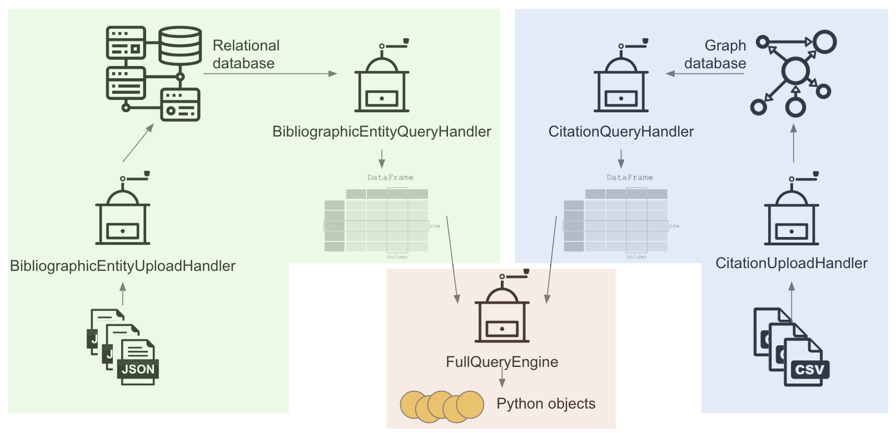
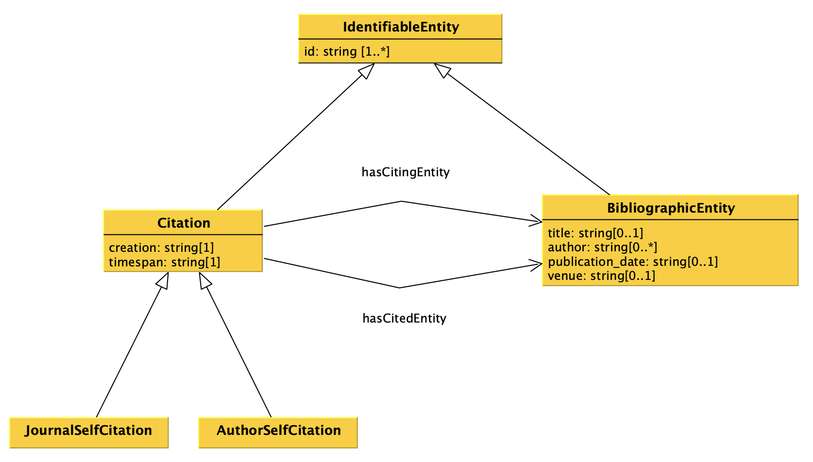
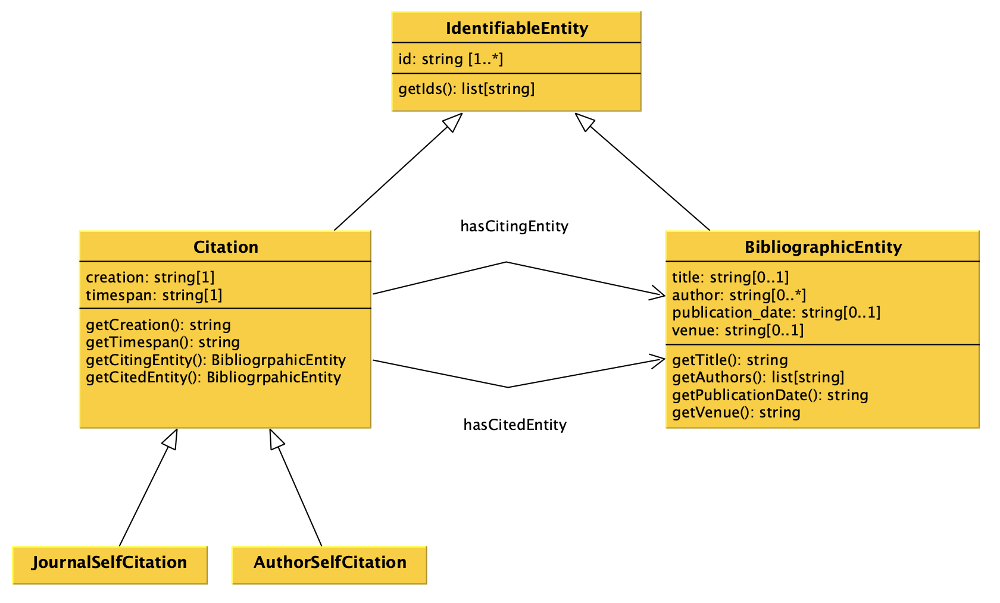
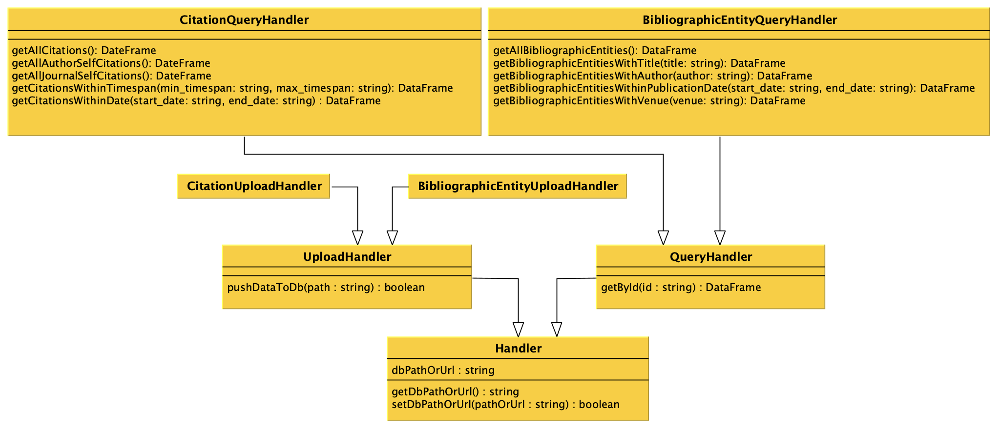
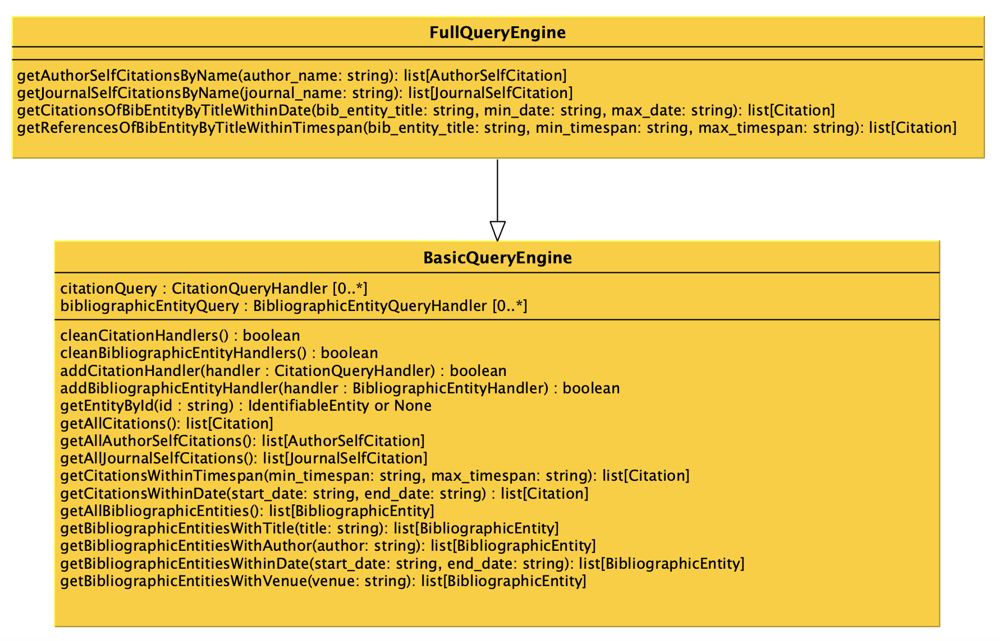

# Computational Management of Data: project

The goal of the project is to develop a software that enables one to process data stored in different formats and to upload them into two distinct databases to query these databases simultaneously according to predefined operations.

## Data

Exemplar datasets for testing the project have been provided. Specifically:

* To create the graph database, a [CSV file](data/dh_citations.csv) is available. It contains a collection of citations retrieved from [OpenCitations](https://OpenCitations.net), involving citing entities whose titles include the words *“Digital Humanities”*.

* To create the relational database, a [JSON file](data/dh_metadata.json) is provided. This file contains information and metadata about all entities involved as either citing or cited items in the citation collection stored in the CSV file.

It is important to note that these two files are intended solely as exemplars. During execution of the developed code, users may supply different CSV and JSON files. However, any alternative files must conform to the same conventions (i.e. structural format) as the exemplar files provided above.


## Workflow



## Data model



## UML of data model classes



All the methods of each class must return the appropriate value that have been specified in the object of that class when it has been created. It is up to the implementer to decide how to enable someone to add this information to the object of each class, e.g. by defining a specific constructor. While one can add additional methods to each class if needed, it is crucial that the *get* and *has* methods introduced in the UML diagram are all defined.

## UML of additional classes




All the attributes methods of each class are defined as follows. All the constructors of each of the class introduced in the UML diagram do not take in input any parameter. While one can add additional methods to each class if needed, it is crucial that all the methods introduced in the UML diagram are defined.


### Class `Handler`

#### Attributes
`dbPathOrUrl`: the variable containing the path or the URL of the database, initially set as an empty string, that will be updated with the method `setDbPathOrUrl`.

#### Methods
`getDbPathOrUrl`: it returns the path or URL of the database.

`setDbPathOrUrl`: it enables to set a new path or URL for the database to handle.


### Class `UploadHandler`

#### Methods
`pushDataToDb`: it takes in input the path of a file containing annotations and uploads them in the database. This method can be called everytime there is a need to upload annotations in the database. The actual implementation of this method is left to its subclasses.


### Classes `BibliographicEntityUploadHandler` and `CitationUploadHandler`

These two classes implements the method of the superclass to handle the specific scenario, i.e. `CitationQueryHandler` to handle CSV files in input and to store their data in a graph database and `BibliographicEntityUploadHandler` to handle JSON files in input and to store their data in a relational database.


### Class `QueryHandler`

#### Methods
`getById`: it returns a data frame with all the identifiable entities (i.e. bibliographic entities, citations, author self citations and journal self citations) matching the input identifier.


### Class `CitationQueryHandler`

#### Methods

`getAllCitations`: it returns a data frame containing all the citations included in the database.  
`getAllAuthorSelfCitations`: it returns a data frame containing all the author self citations included in the database.  
`getAllJournalSelfCitations`: it returns a data frame containing all the journal self citations included in the database.  
`getCitationsWithinTimespan`: it returns a data frame containing all citations in the database whose timespan falls between a specified minimum and maximum value (e.g., between 2 and 10 years, P2Y–P10Y). If either bound is not provided, the corresponding limit is not applied. The timespan value is written in [ISO 8601 duration format](https://docs.digi.com/resources/documentation/digidocs/90001488-13/reference/r_iso_8601_duration_format.htm).  
`getCitationsWithinDate`: it returns a data frame containing all citations in the database whose creation date falls between a specified minimum and maximum value (e.g., between 1990 and 2010). If either bound is not provided, the corresponding limit is not applied.


### Class `BibliographicEntityQueryHandler`

#### Methods

`getAllBibliographicEntities`: it returns a data frame containing all the bibliographic entities included in the database.
`getBibliographicEntitiesWithTitle`: it returns a data frame containing all bibliographic entities in the database whose title either exactly matches the specified value or contains it as a substring.
`getBibliographicEntitiesWithAuthor`: it returns a data frame containing all bibliographic entities in the database for which at least one author matches the specified value (name or surname, or a substring ).
`getBibliographicEntitiesWithinPublicationDate`: it returns a data frame containing all bibliographic entities in the database whose publication date falls between a specified minimum and maximum value (e.g., between 1990-01 and 2008-11). If either bound is not provided, the corresponding limit is not applied.  
`getBibliographicEntitiesWithVenue`: it returns a data frame containing all bibliographic entities in the database whose venue matches the specified value (or part of it).


### Class `BasicQueryEngine`

#### Attributes

`citationQuery`: the variable containing the list of `CitationQueryHandler` objects to involve when one of the *get* methods below is executed. In practice, every time a *get* method is executed, the method will call the related method on all the `CitationQueryHandler` objects included in the variable `citationQuery`, before combining the results with those of other `QueryHandler`(s) and returning the requested object.

`bibliographicEntityQuery`: the variable containing the list of `BibliographicEntityQueryHandler` objects to involve when one of the *get* methods below is executed. In practice, every time a *get* method is executed, the method will call the related method on all the `BibliographicEntityQueryHandler` objects included in the variable `bibliographicEntityQuery`, before combining the results with those of other `QueryHandler`(s) and returning the requested object.

#### Methods

`cleanCitationHandlers`: it cleans the list `citationQuery` from all the `CitationQueryHandler` objects it includes.

`cleanBibliographicEntityHandlers`: it cleans the list `bibliographicEntityQuery` from all the `BibliographicEntityQueryHandler` objects it includes.

`addCitationHandler`: it appends the input `CitationQueryHandler` object to the list `citationQuery`.

`addBibliographicEntityHandler`: it appends the input `BibliographicEntityQueryHandler` object to the list `bibliographicEntityQuery`.

`getEntityById`: it returns an object having class `IdentifiableEntity` identifying the entity available in the databases accessible via the query handlers matching the input identifier (i.e. maximum one entity). In case no entity is identified by the input identifier, `None` must be returned. The object returned must belong to the appropriate class – e.g. if the `IdentifiableEntity` to return is actually a citation, an instance of the class `Citation` (being it a subclass of `IdentifiableEntity`) must be returned.

`getAllCitations`: it returns a list of objects having class `Citation` containing all the citations in the database.

`getAllAuthorSelfCitations`: it returns a list of objects having class `AuthorSelfCitation` retrieved from the database of the citations.

`getAllJournalSelfCitations`: it returns a list of objects having class `JournalSelfCitation` retrieved from the database of the citations.

`getCitationsWithinTimespan`: it returns a list of objects having class `Citation` containing all the citations in the database whose timespan falls between a specified minimum and maximum value (e.g., between 2 and 10 years, P2Y–P10Y). If either bound is not provided, the corresponding limit is not applied.

`getCitationsWithinDate`: it returns a list of objects having class `Citation` containing all the citations in the database whose creation date falls between a specified minimum and maximum value (e.g., between 1990 and 2010). If either bound is not provided, the corresponding limit is not applied.

`getAllBibliographicEntities`: it returns a list of objects having class `BibliographicEntity` containing all the bibliographic entities in the database.

`getBibliographicEntitiesWithTitle`: it returns a list of objects having class `BibliographicEntity` containing all the bibliographic entities in the database whose title either exactly matches the specified value or contains it as a substring.

`getBibliographicEntitiesWithAuthor`: it returns a list of objects having class `BibliographicEntity` containing all the bibliographic entities in the database for which at least one author matches the specified value (name or surname).

`getBibliographicEntitiesWithinDate`: it returns a list of objects having class `BibliographicEntity` containing all the bibliographic entities in the database whose publication date falls between a specified minimum and maximum value (e.g., between 1990-01 and 2008-11). If either bound is not provided, the corresponding limit is not applied.

`getBibliographicEntitiesWithVenue`: it returns a list of objects having class `BibliographicEntity` containing all the bibliographic entities in the database whose venue matches the specified value (or part of it).


### Class `FullQueyEngine`

#### Methods

`getAuthorSelfCitationsByName`: returns a list of `AuthorSelfCitation` objects retrieved from the citation database, where at least one author matching the specified value (name or surname) is an author of both the citing and the cited entity.

`getJournalSelfCitationsByName`: returns a list of `JournalSelfCitation` objects retrieved from the citation database, where at least one venue matching the specified value is the venue of both the citing and the cited entity.

`getCitationsOfBibEntityByTitleWithinDate`: returns a list of `Citation` objects retrieved from the citation database in which the **cited entity’s** title either exactly matches the specified value or contains it as a substring, and whose publication date falls within the specified minimum and maximum range.

`getReferencesOfBibEntityByTitleWithinTimespan`: returns a list of `Citation` objects retrieved from the citation database in which the **citing entity’s** title either exactly matches the specified value or contains it as a substring, and whose timespan falls within the specified minimum and maximum timespan range.


## Uses of the classes

```
# Supposing that all the classes developed for the project
# are contained in the file 'impl.py', then:

# 1) Importing all the classes for handling the relational database
from impl import BibliographicEntityUploadHandler, BibliographicEntityQueryHandler

# 2) Importing all the classes for handling graph database
from impl import CitationUploadHandler, CitationQueryHandler

# 3) Importing the class for dealing with mashup queries
from impl import FullQueryEngine

# Once all the classes are imported, first create the relational
# database using the related source data
rel_path = "relational.db"
be = BibliographicEntityUploadHandler()
be.setDbPathOrUrl(rel_path)
be.pushDataToDb("data/dh_metadata.json")
# Please remember that one could, in principle, push one or more files
# calling the method one or more times (even calling the method twice
# specifying the same file!)

# Then, create the graph database (remember first to run the
# Blazegraph instance) using the related source data
grp_endpoint = "http://127.0.0.1:9999/blazegraph/sparql"
cit = CitationUploadHandler()
cit.setDbPathOrUrl(grp_endpoint)
cit.pushDataToDb("data/dh_citations.csv")
# Please remember that one could, in principle, push one or more files
# calling the method one or more times (even calling the method twice
# specifying the same file!)

# In the next passage, create the query handlers for both
# the databases, using the related classes
be_qh = BibliographicEntityQueryHandler()
be_qh.setDbPathOrUrl(rel_path)

cit_qh = CitationQueryHandler()
cit_qh.setDbPathOrUrl(grp_endpoint)

# Finally, create a advanced mashup object for asking
# about data
que = FullQueryEngine()
que.addBibliographicEntityHandler(be_qh)
que.addCitationHandler(cit_qh)

result_q1 = que.getAllCitations()
result_q2 = que.getCitationsWithinTimespan("P1Y","P5Y")
result_q3 = que.getBibliographicEntitiesWithTitle("Machine learning")
# etc...
```

## Submission of the project

You have to provide all Python files implementing your project, by sharing them in some way (e.g. via OneDrive). You have to send all the files **two days before** the exam session you want to take. Before submitting the project, you must be sure that your code passes a *the basic test: test.py (TBP)* which aims at checking if the code is runnable and compliant with the specification of the UML. The test has been developed using [`unittest`](https://docs.python.org/3/library/unittest.html), which is one of Python libraries dedicated to tests.

## F.A.Q.

1. Is the ID of the method getByID the attribute of the class `IdentifiableEntity`?

   **Answer:** The ID parameter for `getById` does correspond to the `id` attribute of the `IdentifiableEntity` class.

2. What information should be contained in the `DataFrame` returned by the method `getById`?

   **Answer:** It strongly depends on how you address the implementation of the code. As a basic starting point, the data frame returned should contain all the attributes about the entity connected to the given `id` input parameter. However, it may also contain or point to (in some way) all the information related to all the other entities pointed by the one returned. For instance, if `getById` returns attributes about a citation, also the attributes of the citing and cited entities associated to it may be returned as well.

3. In the classes `CitationQueryHandler` and `BibliographicEntityQueryHandler` the methods `getAll[something]`, should return a `DataFrame` containing all the entities with the related attributes or just the entities themselves (e.g. the URIs for the graph database and the id we created for the relational database)?

   **Answer**: It strongly depends on how you address the implementation of the code. The `DataFrame` returned could include all the entities with their related attributes. Returning just the entities themselves, such as URIs for the graph database or IDs for the relational database, might be useful for certain types of queries but generally provides less context than a full set of attributes.

4. We do not understand while there should be multiple `QueryHandlers` in the attribute of the class `BasicQueryEngine`. Are they there in case the user wants to use multiple database of the same kind (es. multiple relational database about citations, multiple graph database about bibliographic entities)?

   **Answer**: The inclusion of multiple `QueryHandlers` for both metadata and process queries in the `BasicQueryEngine` class enables the possibility of querying multiple databases. Here are a few reasons and scenarios where having multiple `QueryHandlers` could be beneficial:

   * Integration of diverse data sources: in a real-world scenario, citations could be stored across various sources, each maintaining its own database.
   * Scalability: as the project or the amount of data grows, you may need to distribute the data across multiple databases to manage load.
   * Data redundancy and reliability: using multiple databases can also enhance the reliability of your application. By storing and accessing data from multiple sources, your application can remain functional even if one of the databases is temporarily unavailable.
   * Specialized databases for different needs: different databases might be optimized for different kinds of queries or data.
   * Development and testing: multiple handlers can be useful in development and testing environments, where you might have separate databases for testing, development, and production.

5. Some ID values have a prefix (e.g., *`doi:`*). What do these represent?

    **Answer:**: the prefix indicates the type of identifier being used. For example, it may specify a DOI, PMID, or OMID, allowing the identifier’s typology to be explicitly recognized.
